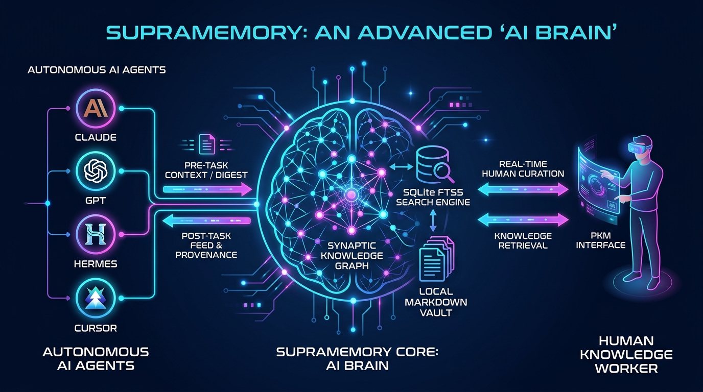
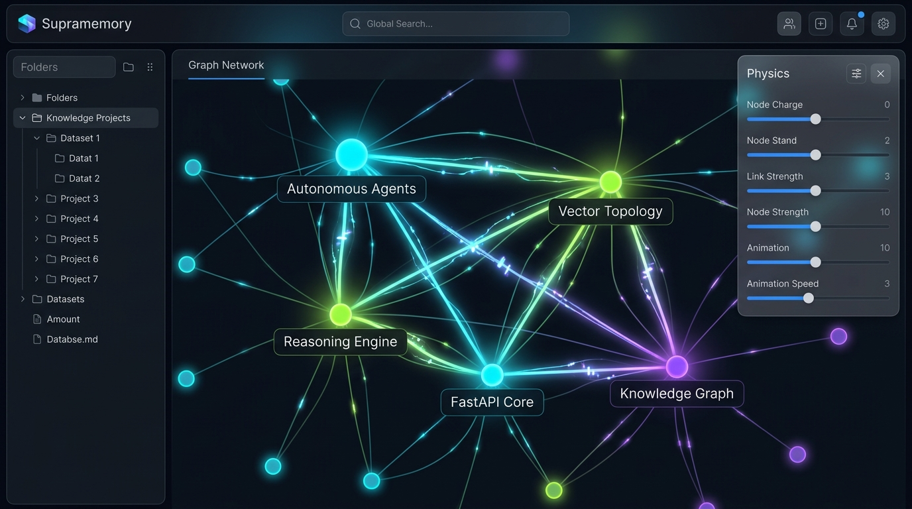
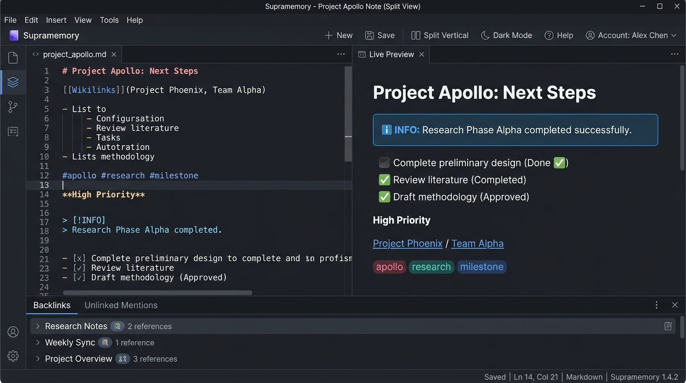
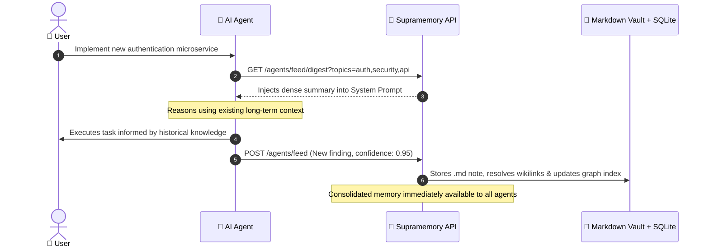
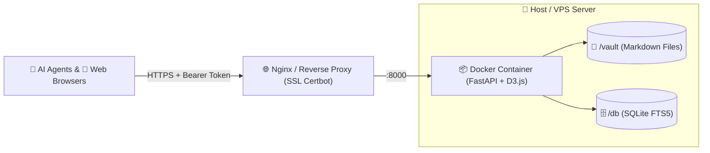
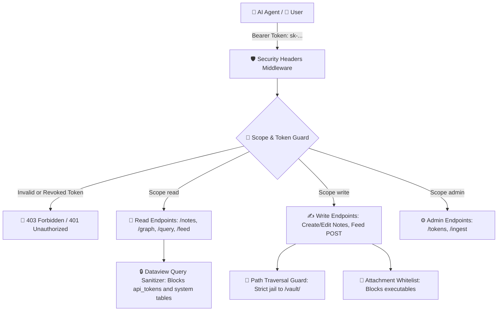

<div align="center">

# 🧠 Supramemory
### **The Open-Source AI Brain & Obsidian-Grade Knowledge Graph**

*The missing link between human Personal Knowledge Management (PKM) and persistent, autonomous Long-Term Memory for AI Agents.*

[](README.md)
[](README.es.md)
[](https://www.python.org/downloads/)
[](https://fastapi.tiangolo.com)
[](https://www.sqlite.org/fts5.html)
[](https://d3js.org)
[](https://docker.com)
[](#)
[](https://opensource.org/licenses/MIT)

---

[✨ Key Features](#-key-features) •
[🏆 Competitive Advantages](#-why-supramemory-advantages-over-obsidian--vector-dbs) •
[🤖 AI Agent Playbook](#-ai-agent-playbook-maximizing-long-term-memory) •
[📝 Obsidian Experience](#-obsidian-grade-pkm-experience-for-humans) •
[🚀 Installation & Deployment](#-installation--deployment-guide-docker--vps) •
[🛡️ Tests & Security](#-security-hardening--automated-test-suite) •
[📡 API Reference](#-api-reference)

---

</div>

<br>

<p align="center">
  
</p>

---

## 💡 What is Supramemory?

**Supramemory** is a **dual-citizen** knowledge operating system:
1. 👤 **For Humans:** A top-tier **Obsidian-grade** Personal Knowledge Management (PKM) environment, featuring an interactive Markdown *Live Preview / Split View* editor, intelligent `[[wikilinks]]` omni-suggest, hierarchical file tree explorer, safe link refactoring (*Safe Rename*), unlinked mentions discovery, and live Dataview queries.
2. 🤖 **For AI Agents:** A high-performance asynchronous REST API and **Model Context Protocol (MCP)** server acting as an **Autonomous Long-Term Brain**, allowing AI agents (Claude, Cursor, Hermes, GPT, Swarms) to retrieve pre-task context, consolidate post-task learnings, and reason across relational knowledge graphs in real time.

All knowledge is built upon a strict **Local-First** philosophy: plain **Markdown (`.md`) files** on disk backed by an embedded **SQLite relational index with FTS5 (BM25 search)**, guaranteeing **zero vendor lock-in**, maximum privacy, and complete human inspectability.

---

## 🏆 Why Supramemory? Advantages over Obsidian & Vector DBs

### 1. Supramemory vs. Obsidian, Notion, and Traditional PKM Tools

| Dimension | Obsidian / Logseq | Notion / Roam | Supramemory |
| :--- | :--- | :--- | :--- |
| **Primary Audience** | 100% Human (Electron Desktop) | SaaS Cloud Note Taking | **Hybrid: Humans + Autonomous AI Agents** |
| **Native Agent API** | ❌ None (requires fragile community plugins) | ⚠️ Slow REST API with strict rate limits | ✅ **Native async REST API + MCP Server** |
| **Headless / Server Mode** | ❌ Cannot run as a VPS headless background service | ❌ Proprietary cloud lock-in | ✅ **100% Headless Docker / VPS** (Coolify, Dokploy) |
| **Multi-Agent Security** | ❌ No token/permission system | ⚠️ Rigid workspace ACLs | ✅ **Granular API Tokens (`read`, `write`, `admin`)** |
| **Provenance Tracking** | ❌ Manual | ❌ Manual | ✅ **Tracks author (`agent:hermes`), confidence (`0.95`), and timestamps** |
| **Data Persistence** | ✅ Local Markdown | ❌ Proprietary Cloud SaaS | ✅ **Plain Markdown on disk + SQLite FTS5** |

### 2. Supramemory vs. Pure Vector Databases (Pinecone, Chroma, Mem0)

Traditional vector databases break information into opaque numerical embeddings:
- ❌ **Black Box:** Humans cannot inspect, browse, or easily curate what the agent learns.
- ❌ **Loss of Explicit Relationships:** Cosine similarity cannot reliably infer exact relational rules (`A depends on B`, `X refactors Y`).
- ❌ **High Token Consumption:** Naive RAG dumps unstructured chunks into prompt windows, causing context bloat and high inference costs.

**The Supramemory Solution:**
- ✅ **Human Curatable:** All memory lives in human-readable `.md` notes and an interactive force-directed visual graph. If an AI hallucinates or records false data, a human can edit it immediately.
- ✅ **Multi-Hop Associative Reasoning:** Merges high-precision BM25 lexical ranking with **graph traversal (`/graph/local/{id}?depth=2`)**.
- ✅ **Token Savings with `/digest`:** Assembles dense, token-optimized executive summaries ready for system prompts, saving up to 80% in token overhead.

---

## 📸 Platform Visual Gallery

<div align="center">

### 🧠 1. Neural Knowledge Graph View
*Real-time force-directed physics powered by D3.js v7 with flowing synaptic pulse particles, glowing halos, and organic layout simulation.*



<br><br>

### 📝 2. Obsidian-Style Live Split-View Editor & Inspector
*Interactive dual-pane Markdown editor with omni-suggest autocompletion for `[[wikilinks]]` and `#tags`, GitHub/Obsidian callouts (`> [!NOTE]`), interactive task lists, and unlinked mentions inspection.*



</div>

---

## 🤖 AI Agent Playbook: Maximizing Long-Term Memory

Supramemory is engineered from the ground up to serve as the unified persistent memory core for autonomous multi-agent architectures.



### 1. Pre-Task Context Injection (Pre-Execution Retrieval)
Before answering queries or executing complex workflows, an agent queries live memory to ground its context:

```python
import requests

API_URL = "https://your-supramemory-instance.com"
TOKEN = "sk-YOUR_AGENT_TOKEN"
HEADERS = {"Authorization": f"Bearer {TOKEN}"}

# Option A: Dense executive summary tailored for system prompt injection
digest = requests.get(
    f"{API_URL}/agents/feed/digest",
    params={"topics": ["auth", "security", "docker"], "limit": 3},
    headers=HEADERS
).json()

system_prompt = f"""
You are a senior systems architect.
{digest['meta']['digest_text']}

Use the accumulated knowledge above to execute the following task.
"""

# Option B: High-precision BM25 lexical context query
context = requests.get(
    f"{API_URL}/context",
    params={"q": "jwt token expiration refresh", "limit": 3},
    headers=HEADERS
).json()
```

---

### 2. Post-Task Learning Consolidation (Continuous Learning)
Once an agent solves a bug, discovers an API requirement, or adopts an architectural guideline, it persists it permanently:

```python
# The agent records its structured finding with provenance and confidence
requests.post(
    f"{API_URL}/agents/feed",
    headers=HEADERS,
    json={
        "title": "JWT Architecture: Key Rotation Strategy",
        "content": "Public verification keys are queried from the JWKS endpoint. See [[API Security]].\n\n- [x] Cache TTL configured to 3600s\n- [ ] Implement token bucket rate limiter",
        "topics": ["security", "jwt", "architecture"],
        "kind": "observation",       # observation | summary | answer | link
        "confidence": 0.95,          # Confidence score (0.0 to 1.0)
        "related": ["API Security", "Docker Microservices"]  # Generates bidirectional wikilinks
    }
)
```

---

### 3. Multi-Agent Shared Swarm Memory (*Swarm Intelligence*)
Specialized agents collaborate asynchronously through the shared knowledge brain without repeating expensive discovery queries:
- 🕵️ **Researcher Agent:** Browses external documentation and publishes notes tagged `#research` with `kind: summary`.
- 💻 **Coding Agent:** Queries `/context?q=research` to guide implementation and records architectural decisions with `kind: observation`.
- 🧪 **QA Agent:** Validates functionality and checks off task lists (`- [x]`) across notes in real time.

---

### 4. Model Context Protocol (MCP) Integration
Supramemory provides an out-of-the-box MCP server compatible with **Claude Desktop**, **Cursor IDE**, **Gemini CLI**, and any MCP client:

```json
{
  "mcpServers": {
    "supramemory": {
      "command": "python",
      "args": ["-m", "scripts.mcp_server"],
      "env": {
        "SUPRAMEMORY_URL": "https://your-supramemory-instance.com",
        "SUPRAMEMORY_API_KEY": "sk-YOUR_TOKEN"
      }
    }
  }
}
```

---

### 5. Associative Multi-Hop Graph Reasoning (*N-Hops Traversal*)
Agents can navigate the local subgraph of any concept to uncover multi-step dependencies that lexical queries cannot reveal:

```python
# Fetch all nodes and edges within 2 hops of "microservices"
subgraph = requests.get(
    f"{API_URL}/graph/local/microservices?depth=2",
    headers=HEADERS
).json()

for edge in subgraph["edges"]:
    print(f"{edge['source']} ---> {edge['target']} ({edge['kind']})")
```

---

## 📝 Obsidian-Grade PKM Experience (For Humans)

Supramemory delivers a complete human-facing interface tuned for modern personal knowledge workflows:

- ✏️ **Live Split-View Editor:** Side-by-side editing with instant client-side preview rendering alongside raw Markdown.
- 🔍 **Omni-Suggest Autocompletion:** Type `[[` for note linking or `#` for tag lookup with arrow-key keyboard navigation (`↑`, `↓`, `Enter`, `Esc`).
- 📁 **File Tree Explorer:** Nested folder hierarchy with unlimited depth mirroring the physical `/vault/` folder.
- 🔗 **Safe Rename Link Refactoring:** Renaming a note automatically cascades across all `[[wikilinks]]` in the entire vault.
- 💡 **Unlinked Mentions Detection:** Automatically scans for plain-text mentions and provides a 1-click **"🔗 Link"** action to turn them into wikilinks.
- 📋 **Callouts & Interactive Checklists:** Full support for callout alerts (`> [!NOTE]`, `> [!TIP]`, `> [!WARNING]`, `> [!IMPORTANT]`, `> [!DANGER]`) and interactive checklists (`- [ ]` / `- [x]`).
- ⚡ **Dynamic Queries (Dataview):** Embed live SQL query blocks: ` ```query SELECT title, tags FROM notes WHERE tag = 'project' ``` `.
- 📅 **Daily Notes:** 1-click daily note creation based on customizable templates (`{{date}}`, `{{time}}`, `{{title}}`).
- 📎 **Image Clipboard Pasting (`Ctrl+V`) & Drag-and-Drop:** Automatically saves image attachments into `/vault/attachments/` and inserts `![[image.png]]`.

---

## 🚀 Installation & Deployment Guide (Docker & VPS)

Supramemory can be deployed in seconds on your local machine or any production cloud VPS.



---

### 🐳 Option 1: Local Docker Compose (Recommended)

The cleanest and fastest way to run Supramemory locally with full data persistence:

```bash
# 1. Clone the repository
git clone https://github.com/MikelCuellar/supramemory.git
cd supramemory

# 2. Configure environment variables
cp .env.example .env
# Edit .env and set a secure master API_KEY

# 3. Build and launch in background
docker compose up -d --build

# 4. Verify service status and logs
docker compose ps
docker compose logs -f

# 5. Check health endpoint
curl http://localhost:8000/health
# Open in your browser: http://localhost:8000
```

---

### 📦 Option 2: Standalone Docker CLI

If you prefer launching directly via Docker CLI with host volume mounts:

```bash
# 1. Build the Docker image
docker build -t supramemory:latest .

# 2. Create local persistent storage directories
mkdir -p ./data/vault ./data/db

# 3. Run the container
docker run -d \
  --name supramemory \
  -p 8000:8000 \
  -v "$(pwd)/data/vault:/vault:rw" \
  -v "$(pwd)/data/db:/db:rw" \
  -e API_KEY="your-secure-master-api-key" \
  -e LOG_LEVEL="info" \
  -e CORS_ORIGINS="*" \
  --restart unless-stopped \
  supramemory:latest
```

---

### 🌐 Option 3: Production Linux VPS Deployment (Ubuntu / Debian with Nginx + SSL)

Step-by-step production deployment guide for cloud providers (Hetzner, DigitalOcean, AWS, Linode, OVH):

#### 1. Server Setup and Code Checkout
```bash
# Install Docker & Docker Compose
curl -fsSL https://get.docker.com | sh

# Prepare deployment directory
sudo mkdir -p /opt/supramemory
sudo chown $USER:$USER /opt/supramemory
cd /opt/supramemory

# Clone repository
git clone https://github.com/MikelCuellar/supramemory.git .
```

#### 2. Configure Production Environment
```bash
cat << 'EOF' > .env
PORT=8000
API_KEY=GenerateAStrongMasterKeyHere_sk99382193
LOG_LEVEL=info
CORS_ORIGINS=*
VAULT_PATH=/vault
DB_PATH=/db/supramemory.db
EOF
```

#### 3. Launch with Docker Compose
```bash
docker compose up -d --build
```

#### 4. Configure Nginx Reverse Proxy with Let's Encrypt SSL
Create the Nginx configuration at `/etc/nginx/sites-available/supramemory`:

```nginx
server {
    server_name supramemory.yourdomain.com;

    client_max_body_size 50M;

    location / {
        proxy_pass http://127.0.0.1:8000;
        proxy_http_version 1.1;
        
        # Standard proxy headers
        proxy_set_header Host $host;
        proxy_set_header X-Real-IP $remote_addr;
        proxy_set_header X-Forwarded-For $proxy_add_x_forwarded_for;
        proxy_set_header X-Forwarded-Proto $scheme;
        proxy_set_header Authorization $http_authorization;

        # WebSocket support for live editor & graph updates
        proxy_set_header Upgrade $http_upgrade;
        proxy_set_header Connection "upgrade";
    }
}
```

Enable site and provision SSL certificates:
```bash
sudo ln -s /etc/nginx/sites-available/supramemory /etc/nginx/sites-enabled/
sudo nginx -t && sudo systemctl reload nginx
sudo certbot --nginx -d supramemory.yourdomain.com
```

---

### ⚡ Option 4: 1-Click Deployment on Coolify, Dokploy, or Portainer

Supramemory is 100% cloud-native and ready for self-hosted PaaS platforms:

1. **Create New Application** pointing to the GitHub repo: `https://github.com/MikelCuellar/supramemory`.
2. **Build Pack:** Dockerfile.
3. **Persistent Volume Mounts (Essential):**
   - Container Destination: `/vault` ➔ Persistent storage for `.md` notes and attachments.
   - Container Destination: `/db` ➔ Relational database and search index `supramemory.db`.
4. **Environment Variables:**
   - `API_KEY`: Your master administrative API key.
   - `PORT`: `8000` (or your platform's internal target port).

---

### 🐍 Option 5: Local Python Development (Without Docker)

```bash
# 1. Create and activate virtual environment
python3 -m venv .venv
source .venv/bin/activate   # On Windows: .venv\Scripts\activate

# 2. Install dependencies
pip install -r requirements.txt

# 3. Configure and run development server
cp .env.example .env
uvicorn api.main:app --reload --port 8000
```

---

## 📡 API Reference

All private endpoints require Bearer authentication: `Authorization: Bearer <TOKEN>`.

### 🧠 Memory & AI Agent Endpoints
| Method | Endpoint | Required Scope | Description |
| :--- | :--- | :--- | :--- |
| `GET` | `/context?q=...&limit=5` | `read` | **Flagship:** High-relevance BM25 context snippets and notes. |
| `GET` | `/agents/feed/digest?topics=...` | `read` | **Flagship:** Token-optimized dense summary for prompt injection. |
| `POST` | `/agents/feed` | `write` | Contributes structured findings with provenance and confidence. |
| `GET` | `/agents/feed?topics=...` | `read` | Queries knowledge feeds filtered by topics. |

### 📝 Notes & Vault (Obsidian Parity)
| Method | Endpoint | Required Scope | Description |
| :--- | :--- | :--- | :--- |
| `GET` | `/notes` | `read` | Lists notes with filtering (`?tag=`, `?source=`, `?limit=`). |
| `GET` | `/notes/tree` | `read` | Returns the hierarchical file and folder tree of the vault. |
| `POST` | `/notes` | `write` | Creates a note in SQLite and writes the `.md` file to disk. |
| `GET` | `/notes/{id}` | `read` | Returns raw markdown content, metadata, tags, and links. |
| `GET` | `/notes/{id}/render` | `read` | Returns rendered HTML (Callouts, Dataview blocks, Wikilinks). |
| `POST` | `/notes/rename?note_id=...` | `write` | **Safe Rename:** Renames note and refactors wikilinks across vault. |
| `GET` | `/notes/{id}/unlinked-mentions` | `read` | Finds plain-text unlinked mentions of this note in the vault. |
| `POST` | `/notes/{id}/link-mention` | `write` | Converts an unlinked mention into an explicit `[[wikilink]]`. |
| `POST` | `/notes/daily` | `write` | Opens or creates today's Daily Note (`YYYY-MM-DD.md`). |
| `POST` | `/notes/folders` | `write` | Creates a new directory inside `/vault/`. |
| `POST` | `/notes/move` | `write` | Moves a note to a different folder path in the vault. |
| `POST` | `/notes/attachments` | `write` | Uploads an attachment to `/vault/attachments/`. |

### 🕸️ Knowledge Graph & Queries
| Method | Endpoint | Required Scope | Description |
| :--- | :--- | :--- | :--- |
| `GET` | `/graph` | `read` | Nodes and edges for D3.js neural graph simulation. |
| `GET` | `/graph/local/{note_id}?depth=2`| `read` | **Local Graph:** Centered subgraph within *N* relational hops. |
| `GET` | `/query?q=...` | `read` | Full-text FTS5 search with BM25 ranking. |
| `POST` | `/query/execute` | `read` | Executes sanitized read-only dynamic SQL queries. |

### 🔑 Security & Token Management (Admin Only)
| Method | Endpoint | Required Scope | Description |
| :--- | :--- | :--- | :--- |
| `POST` | `/tokens` | `admin` | Issues a new API Token with scopes (`read`, `write`, `admin`). |
| `GET` | `/tokens` | `admin` | Lists existing tokens and last-used metadata. |
| `POST` | `/tokens/{name}/revoke` | `admin` | Revokes an active token immediately. |
| `DELETE` | `/tokens/{name}` | `admin` | Permanently deletes a token. |

---

## 💻 Integration Code Examples

### Python Client (Hermes / LangChain / LlamaIndex)

```python
from scripts.hermes_client import HermesSupramemory

# 1. Initialize client with agent token
brain = HermesSupramemory(
    api_url="https://your-supramemory-instance.com",
    token="sk-YOUR_AGENT_TOKEN"
)

# 2. Query long-term memory before answering
context = brain.get_context(query="docker redis clustering", limit=3)

# 3. Persist new finding post-task
brain.save_learning(
    title="Redis Cluster: Sentinel Configuration",
    content="For high availability, Sentinel requires a quorum of 2 nodes. See [[Docker Compose]].",
    topics=["redis", "docker", "infrastructure"],
    related=["Docker Compose", "Microservices"]
)
```

### TypeScript / JavaScript (Node.js / Bun / Next.js)

```typescript
const API_URL = "https://your-supramemory-instance.com";
const TOKEN = "sk-YOUR_AGENT_TOKEN";

// Query contextual memory
async function fetchMemory(query: string) {
  const res = await fetch(`${API_URL}/context?q=${encodeURIComponent(query)}&limit=3`, {
    headers: { Authorization: `Bearer ${TOKEN}` }
  });
  return await res.json();
}

// Record agent finding
async function recordObservation(title: string, markdown: string, topics: string[]) {
  await fetch(`${API_URL}/agents/feed`, {
    method: "POST",
    headers: {
      "Content-Type": "application/json",
      Authorization: `Bearer ${TOKEN}`
    },
    body: JSON.stringify({
      title,
      content: markdown,
      topics,
      kind: "observation",
      confidence: 0.9
    })
  });
}
```

---

## 📁 Repository Structure

```
supramemory/
├── api/                       # FastAPI Backend
│   ├── core/                  # Configuration, SQLite FTS5 Database, RBAC Scopes
│   ├── routers/               # REST Endpoints (/notes, /graph, /agents, /query, /tokens)
│   └── services/              # Domain Logic (Markdown, Refactor, Vault Tree, Query Engine)
├── frontend/                  # Web Client (Vanilla JS + D3.js v7, zero build step)
│   ├── index.html             # Main Layout (Explorer + Editor + Graph + Tokens)
│   └── static/                # Modular JS (app, graph, editor, explorer, tokens) & CSS
├── data/                      # Local persistent volumes
│   ├── vault/                 # Plain Markdown notes (.md) and attachments/
│   └── db/                    # SQLite database (supramemory.db)
├── scripts/                   # AI Agent integrations (hermes_client.py, mcp_server.py)
├── tests/                     # Automated test suites (test_api.py, test_obsidian.py, test_security.py)
├── docs/                      # Architectural guides, API documentation, screenshots
├── Dockerfile                 # Optimized multi-stage Docker build
└── docker-compose.yml         # Container orchestration configuration
```

---

## 🛡️ Security Hardening & Automated Test Suite

Supramemory enforces a defense-in-depth model built around **"Frictionless AI Access"**: maximum protection against unauthorized access without introducing friction for AI agents (such as CAPTCHAs, session cookies, or complex OAuth handshakes).



---

### 🧪 1. Tested Security Dimensions

Every security layer is verified by automated regression tests in [`tests/test_security.py`](tests/test_security.py):

| Security Dimension | Automated Test | Mitigated Vulnerability / Verified Behavior |
| :--- | :--- | :--- |
| **Universal Access Control** | `test_unauthenticated_endpoints_rejected` | All private endpoints (`/notes`, `/tokens`, `/query`, `/graph`, `/agents/feed`, `/ingest`) reject anonymous requests with `401 Unauthorized`. |
| **Timing Attack Mitigation** | `secrets.compare_digest` in `security.py` | Master key comparison uses constant-time validation to prevent side-channel timing attacks. |
| **Strict Scope Isolation (RBAC)** | `test_read_scope_cannot_perform_writes_or_admin` | A token with `read` scope can browse notes, graphs, and feeds, but is strictly **forbidden** from modifying files or managing tokens (`403 Forbidden`). |
| **Admin Privilege Separation** | `test_write_scope_cannot_perform_admin` | A token with `write` scope can create and edit notes, but cannot generate or revoke tokens or reindex vaults (`403 Forbidden`). |
| **SQL Credential Theft Protection** | `test_query_engine_blocks_credential_theft` | The `/query/execute` engine blocks queries attempting to read `api_tokens` or SQLite system schemas (`sqlite_master`, `sqlite_schema`, `sqlite_sequence`). |
| **Destructive DDL/DML Blocking** | `test_query_engine_blocks_ddl_and_dml` | Rejects `DROP`, `DELETE`, `UPDATE`, `INSERT`, `ALTER`, or `PRAGMA` statements in dynamic queries. |
| **Path Traversal Prevention** | `test_path_traversal_in_folders_blocked`, `test_path_traversal_in_move_note_blocked` | Strict `is_relative_to` validation and `..` sequence blocking prevents file operations from escaping `/vault/`. |
| **Attachment Extension Whitelist** | `test_dangerous_attachment_extensions_rejected` | Blocks dangerous executable extensions (`.exe`, `.sh`, `.php`, `.py`, `.bat`), allowing only safe media and document formats. |
| **HTTP Security Headers** | `test_security_headers_injected_in_responses` | Automatically injects `X-Content-Type-Options: nosniff`, `X-Frame-Options: DENY`, `X-XSS-Protection: 1; mode=block`, and `Referrer-Policy: strict-origin-when-cross-origin`. |
| **Token Lifecycle & Expiration** | `test_expired_token_rejected`, `test_revoke_token` | Revoked tokens or tokens past their `expires_at` timestamp are invalidated immediately. |

---

### 📊 2. Running the Test Suite

To run the complete automated test battery (API functionality, Obsidian parity, and security hardening):

```bash
# Run all tests with pytest
pytest -v
```

```
============================= test session starts =============================
platform win32 -- Python 3.11.16, pytest-9.1.1, pluggy-1.6.0
collected 38 items

tests/test_api.py::test_health PASSED                                    [  2%]
tests/test_api.py::test_health_no_auth_required PASSED                   [  5%]
tests/test_api.py::test_notes_require_auth PASSED                        [  7%]
tests/test_api.py::test_create_and_get_note PASSED                       [ 10%]
tests/test_api.py::test_query_search PASSED                              [ 13%]
tests/test_api.py::test_context_endpoint PASSED                          [ 15%]
tests/test_api.py::test_graph_endpoint PASSED                            [ 18%]
tests/test_api.py::test_create_token_as_admin PASSED                     [ 21%]
tests/test_api.py::test_create_token_requires_admin PASSED               [ 23%]
tests/test_api.py::test_list_tokens PASSED                               [ 26%]
tests/test_api.py::test_use_token_for_read PASSED                        [ 28%]
tests/test_api.py::test_use_token_for_write_blocks_read_only PASSED      [ 31%]
tests/test_api.py::test_revoke_token PASSED                              [ 34%]
tests/test_api.py::test_agents_feed_contribute PASSED                    [ 36%]
tests/test_api.py::test_agents_feed_consume PASSED                       [ 39%]
tests/test_api.py::test_agents_feed_digest PASSED                        [ 42%]
tests/test_obsidian.py::test_markdown_callouts_and_checklists PASSED     [ 44%]
tests/test_obsidian.py::test_tree_and_folders PASSED                     [ 47%]
tests/test_obsidian.py::test_safe_rename PASSED                          [ 50%]
tests/test_obsidian.py::test_unlinked_mentions_and_link PASSED           [ 52%]
tests/test_obsidian.py::test_local_graph PASSED                          [ 55%]
tests/test_obsidian.py::test_daily_note PASSED                           [ 57%]
tests/test_obsidian.py::test_dynamic_query PASSED                        [ 60%]
tests/test_security.py::test_unauthenticated_endpoints_rejected PASSED   [ 63%]
tests/test_security.py::test_public_health_endpoint_remains_accessible PASSED [ 65%]
tests/test_security.py::test_invalid_token_returns_403 PASSED            [ 68%]
tests/test_security.py::test_malformed_auth_header PASSED                [ 71%]
tests/test_security.py::test_expired_token_rejected PASSED               [ 73%]
tests/test_security.py::test_read_scope_cannot_perform_writes_or_admin PASSED [ 76%]
tests/test_security.py::test_write_scope_cannot_perform_admin PASSED     [ 78%]
tests/test_security.py::test_query_engine_blocks_credential_theft PASSED [ 81%]
tests/test_security.py::test_query_engine_blocks_ddl_and_dml PASSED      [ 84%]
tests/test_security.py::test_query_engine_allows_legitimate_read_queries PASSED [ 86%]
tests/test_security.py::test_path_traversal_in_folders_blocked PASSED    [ 89%]
tests/test_security.py::test_path_traversal_in_move_note_blocked PASSED  [ 92%]
tests/test_security.py::test_dangerous_attachment_extensions_rejected PASSED [ 94%]
tests/test_security.py::test_safe_attachment_allowed PASSED              [ 97%]
tests/test_security.py::test_security_headers_injected_in_responses PASSED [100%]

======================= 38 passed in 6.75s (100%) =======================
```

---

## 🔒 Privacy & Local-First Guarantees

- **Zero Telemetry:** No telemetry, tracking, or analytics data leaves your host or VPS.
- **Cryptographic Hashing:** API tokens are stored using SHA-256 hashes in the SQLite database. Plaintext tokens are only displayed once upon creation.
- **Production Proven:** Audited and verified in active production environments (`supramemory.grupogeo.cl`).

---

## 📄 License

This project is open-source under the **MIT License**. You are free to use, modify, and distribute it for personal or commercial projects.
