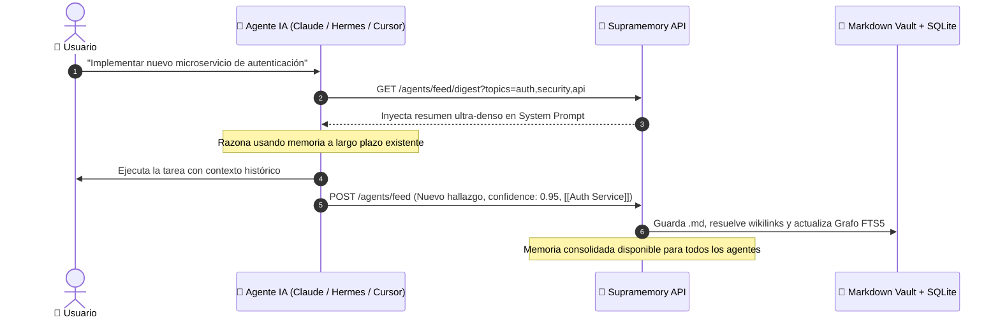

<div align="center">

# 🧠 Supramemory
### **The Open-Source AI Brain & Obsidian-Grade Knowledge Graph**

*The missing link between human Personal Knowledge Management (PKM) and persistent, autonomous Long-Term Memory for AI Agents.*

[](https://www.python.org/downloads/)
[](https://fastapi.tiangolo.com)
[](https://www.sqlite.org/fts5.html)
[](https://d3js.org)
[](https://docker.com)
[](#)
[](https://opensource.org/licenses/MIT)

---

[✨ Características](#-características-principales) •
[🏆 Ventajas Competitivas](#-por-qué-supramemory-ventajas-frente-a-obsidian-y-vector-dbs) •
[🤖 Playbook para Agentes IA](#-playbook-del-cerebro-ia-cómo-sacarle-el-máximo-provecho) •
[📝 Experiencia Obsidian](#-experiencia-pkm-estilo-obsidian-para-humanos) •
[🚀 Quickstart](#-quickstart) •
[📡 API Reference](#-referencia-de-api)

---

</div>

<br>

<p align="center">
  
</p>

---

## 💡 ¿Qué es Supramemory?

**Supramemory** es un sistema de conocimiento de **doble ciudadanía**:
1. 👤 **Para Humanos:** Un entorno de gestión de conocimiento personal (PKM) de nivel **Obsidian**, con editor Markdown *Live Preview / Split Mode*, autocompletado inteligente `[[wikilinks]]`, explorador de carpetas, refactorización segura de nombres (*Safe Rename*), menciones no enlazadas y consultas dinámicas tipo Dataview.
2. 🤖 **Para Agentes de IA:** Una API REST asíncrona de alto rendimiento y servidor **Model Context Protocol (MCP)** que actúa como **Memoria Viva y Cerebro a Largo Plazo**, permitiendo a agentes (Claude, Cursor, Hermes, GPT, Swarms) consultar contexto pre-tarea, consolidar aprendizajes post-tarea y razonar sobre grafos relacionales en tiempo real.

Toda la información se almacena con filosofía **Local-First**: notas en **Markdown plano (`.md`)** en disco respaldadas por un índice relacional **SQLite con FTS5 (BM25)**, garantizando **cero vendor lock-in** e inspeccionabilidad humana total.

---

## 🏆 ¿Por qué Supramemory? Ventajas frente a Obsidian y Vector DBs

### 1. Supramemory vs. Obsidian, Notion y Herramientas PKM

| Dimensión | Obsidian / Logseq | Notion / Roam | Supramemory |
| :--- | :--- | :--- | :--- |
| **Público Objetivo** | 100% Humano (Desktop Electron) | Gestión de notas SaaS en nube | **Híbrido: Humanos + Enjambre de Agentes IA** |
| **API Nativa para Agentes** | ❌ Inexistente (requiere plugins inestables) | ⚠️ API REST lenta con límites de tasa | ✅ **API REST asíncrona nativa + MCP Server** |
| **Modo Headless / Servidor** | ❌ No puede correr como servicio en VPS | ❌ Cerrado en servidores propietarios | ✅ **100% Headless Docker / VPS** (Coolify, Dokploy) |
| **Seguridad Multi-Agente** | ❌ Sin soporte de tokens | ⚠️ Permisos rígidos de workspace | ✅ **API Tokens con scopes (`read`, `write`, `admin`)** |
| **Trazabilidad (*Provenance*)**| ❌ Manual | ❌ Manual | ✅ **Registra autoría (`agent:hermes`), confianza (`0.95`) y timestamps** |
| **Persistencia** | ✅ Markdown local | ❌ Propietario / Lock-in SaaS | ✅ **Markdown plano en disco + SQLite FTS5** |

### 2. Supramemory vs. Bases de Datos Vectoriales Puras (Pinecone, Chroma, Mem0)

Las bases de datos vectoriales tradicionales fragmentan la información en incrustaciones (*embeddings*) numéricas opacas:
- ❌ **Caja Negra:** El humano no puede ver, navegar ni corregir fácilmente lo que el agente aprende.
- ❌ **Pérdida de Relaciones Explícitas:** La similitud por coseno no entiende dependencias directas (`A depende de B`, `X refactoriza Y`).
- ❌ **Alto Consumo de Tokens:** El RAG clásico inyecta fragmentos desestructurados que saturan la ventana de contexto.

**La Solución Supramemory:**
- ✅ **Curaduría y Corrección Humana:** Toda la memoria vive en archivos `.md` planos y en un grafo visual interactivo. Si la IA aprende un dato erróneo, el humano lo edita directamente.
- ✅ **Razonamiento Asociativo Multidimensional:** Combina búsqueda léxica BM25 de alta precisión con **recorrido de grafos a *N* saltos (`/graph/local/{id}?depth=2`)**.
- ✅ **Ahorro de Tokens con `/digest`:** Genera resúmenes ejecutivos condensados listos para inyectar en el prompt del sistema, ahorrando hasta un 80% de tokens.

---

## 📸 Galería Visual de la Plataforma

<div align="center">

### 🧠 1. Vista de Red Neuronal (Brain-like Knowledge Graph)
*Simulación física en tiempo real impulsada por D3.js v7 con impulsos sinápticos animados, halos de energía y física de flotación.*


<br><br>

### 📝 2. Editor Live Split-View & Inspector estilo Obsidian
*Editor interactivo con doble panel, autocompletado omni-suggest para `[[wikilinks]]` y `#tags`, Callouts (`> [!NOTE]`), checklists y panel de menciones no enlazadas.*


</div>

---

## 🤖 Playbook del Cerebro IA: Cómo Sacarle el Máximo Provecho

Supramemory está diseñado desde su núcleo para ser el centro de memoria persistente de cualquier arquitectura de Agentes Autónomos.



### 1. Inyección de Contexto Pre-Tarea (Pre-Execution Retrieval)
Antes de responder una consulta o ejecutar un plan, el agente consulta la memoria viva para no empezar desde cero:

```python
import requests

API_URL = "https://tu-supramemory.dominio.com"
TOKEN = "sk-TU_AGENTE_TOKEN"
HEADERS = {"Authorization": f"Bearer {TOKEN}"}

# Opción A: Resumen ejecutivo condensado para inyectar en prompt
digest = requests.get(
    f"{API_URL}/agents/feed/digest",
    params={"topics": ["autenticacion", "seguridad", "docker"], "limit": 3},
    headers=HEADERS
).json()

system_prompt = f"""
Eres un agente de arquitectura senior.
{digest['meta']['digest_text']}

Utiliza el conocimiento anterior para ejecutar la siguiente tarea.
"""

# Opción B: Búsqueda granular por relevancia BM25
context = requests.get(
    f"{API_URL}/context",
    params={"q": "tokens jwt expiracion", "limit": 3},
    headers=HEADERS
).json()
```

---

### 2. Consolidación de Aprendizajes Post-Tarea (Continuous Learning)
Cuando el agente completa una tarea, descubre una solución o detecta una regla operativa, la persiste estructuradamente:

```python
# El agente registra su aprendizaje con provenance y certeza
requests.post(
    f"{API_URL}/agents/feed",
    headers=HEADERS,
    json={
        "title": "Arquitectura JWT: Rotación de Claves",
        "content": "Las claves públicas se verifican contra el endpoint JWKS. Ver [[Seguridad API]].\n\n- [x] Cache TTL configurado en 3600s\n- [ ] Añadir rate limit",
        "topics": ["seguridad", "jwt", "arquitectura"],
        "kind": "observation",       # observation | summary | answer | link
        "confidence": 0.95,          # Nivel de certeza (0.0 a 1.0)
        "related": ["Seguridad API", "Docker Microservices"]  # Genera wikilinks automáticos
    }
)
```

---

### 3. Memoria Compartida Multi-Agente (*Swarm Intelligence*)
Múltiples agentes especializados pueden colaborar a través del mismo cerebro sin duplicar llamadas ni saturar ventanas de contexto:
- 🕵️ **Agente Investigador:** Lee documentación externa y aporta notas con `kind: summary` y tags `#research`.
- 💻 **Agente Programador:** Consulta `/context?q=research` para programar la solución y aporta notas con `kind: observation`.
- 🧪 **Agente QA:** Valida la implementación y actualiza los checklists `- [x]` de las notas en tiempo real.

---

### 4. Integración con Model Context Protocol (MCP)
Supramemory expone un servidor MCP listo para conectar con **Claude Desktop**, **Cursor IDE**, **Gemini CLI** o cualquier cliente compatible:

```json
{
  "mcpServers": {
    "supramemory": {
      "command": "python",
      "args": ["-m", "scripts.mcp_server"],
      "env": {
        "SUPRAMEMORY_URL": "https://tu-supramemory.dominio.com",
        "SUPRAMEMORY_API_KEY": "sk-TU_TOKEN"
      }
    }
  }
}
```

---

### 5. Razonamiento Asociativo por Grafos (*N-Hops Traversal*)
Los agentes pueden navegar el subgrafo local de cualquier concepto para inferir relaciones complejas no evidentes mediante búsqueda léxica:

```python
# Obtener todos los nodos y conexiones a 2 saltos de distancia de "microservicios"
subgraph = requests.get(
    f"{API_URL}/graph/local/microservicios?depth=2",
    headers=HEADERS
).json()

for edge in subgraph["edges"]:
    print(f"{edge['source']} ---> {edge['target']} ({edge['kind']})")
```

---

## 📝 Experiencia PKM Estilo Obsidian (Para Humanos)

Supramemory ofrece una interfaz visual completa diseñada para el flujo de trabajo moderno de toma de notas:

- ✏️ **Live Split Editor:** Edición lado a lado (código Markdown a la izquierda + render HTML interactivo a la derecha).
- 🔍 **Autocompletado Omni-Suggest:** Al escribir `[[` o `#`, se despliega un menú flotante con búsqueda difusa de notas y tags existentes.
- 📁 **Explorador de Carpetas (*File Tree*):** Organización jerárquica con subdirectorios ilimitados en `/vault/`.
- 🔗 **Refactorización Segura (*Safe Rename*):** Al renombrar una nota, Supramemory actualiza automáticamente todos los `[[wikilinks]]` en el resto del vault.
- 💡 **Menciones No Enlazadas (*Unlinked Mentions*):** Detecta menciones en texto plano y ofrece un botón de 1-click **"🔗 Enlazar"** para convertirlas en wikilinks.
- 📋 **Callouts & Checklists:** Soporte completo para cajas de alerta (`> [!NOTE]`, `> [!TIP]`, `> [!WARNING]`, `> [!IMPORTANT]`, `> [!DANGER]`) y tareas interactivas `- [ ]` / `- [x]`.
- ⚡ **Consultas Dinámicas (Dataview):** Bloques ` ```query SELECT title, tags FROM notes WHERE tag = 'proyecto' ``` ` que renderizan tablas en vivo.
- 📅 **Notas Diarias (*Daily Notes*):** Acceso rápido con 1 clic para crear o abrir la nota de hoy basada en plantillas (`{{date}}`, `{{time}}`, `{{title}}`).
- 📎 **Arrastre y Pegado de Imágenes (`Ctrl+V`):** Sube automáticamente imágenes y multimedia a `/vault/attachments/` e inserta `![[imagen.png]]`.

---

## 🚀 Quickstart

### Opción A: Desarrollo Local (Python + Virtualenv)

```bash
# 1. Clonar repositorio
git clone https://github.com/MikelCuellar/supramemory.git
cd supramemory

# 2. Crear entorno virtual e instalar dependencias
python3 -m venv .venv
source .venv/bin/activate   # En Windows: .venv\Scripts\activate
pip install -r requirements.txt

# 3. Configurar variables de entorno
cp .env.example .env

# 4. Iniciar servidor FastAPI
uvicorn api.main:app --reload --port 8000
# Abrir en el navegador: http://localhost:8000
```

### Opción B: Docker & Docker Compose

```bash
docker compose up -d --build
# Tu cerebro Supramemory estará corriendo en http://localhost:8000
```

### Opción C: Despliegue en 1-Clic en Coolify o Dokploy
Supramemory incluye configuración nativa para **Dokploy**, **Coolify** y **Nixpacks**. Simplemente conecta tu repositorio Git, monta los volúmenes `/vault` y `/db`, y configura `API_KEY`.

---

## 📡 Referencia de API

Todos los endpoints (excepto `/health` y documentación) requieren autorización mediante token: `Authorization: Bearer <TOKEN>`.

### 🧠 Memoria y Agentes IA
| Método | Endpoint | Scope | Descripción |
| :--- | :--- | :--- | :--- |
| `GET` | `/context?q=...&limit=5` | `read` | **Estrella:** Devuelve fragmentos y notas de alta relevancia BM25. |
| `GET` | `/agents/feed/digest?topics=...` | `write` | **Estrella:** Resumen ultra-denso listo para inyectar en prompts. |
| `POST` | `/agents/feed` | `write` | Aporta aprendizajes estructurados con autoría y nivel de confianza. |
| `GET` | `/agents/feed?topics=...` | `write` | Consulta feeds de conocimiento por tópicos. |

### 📝 Notas y Vault (Paridad Obsidian)
| Método | Endpoint | Scope | Descripción |
| :--- | :--- | :--- | :--- |
| `GET` | `/notes` | `read` | Lista notas con filtros (`?tag=`, `?source=`, `?limit=`). |
| `GET` | `/notes/tree` | `read` | Obtiene el árbol jerárquico de archivos y carpetas del vault. |
| `POST` | `/notes` | `write` | Crea una nota en base de datos y archivo `.md` en disco. |
| `GET` | `/notes/{id}` | `read` | Obtiene el contenido plano, tags y enlaces de una nota. |
| `GET` | `/notes/{id}/render` | `read` | Obtiene el renderizado HTML completo (Callouts, Dataview, Wikilinks). |
| `POST` | `/notes/rename?note_id=...` | `write` | **Safe Rename:** Renombra la nota y refactoriza wikilinks en todo el vault. |
| `GET` | `/notes/{id}/unlinked-mentions` | `read` | Encuentra menciones no enlazadas de esta nota en el vault. |
| `POST` | `/notes/{id}/link-mention` | `write` | Convierte una mención en texto plano en un `[[wikilink]]`. |
| `POST` | `/notes/daily` | `write` | Abre o crea la nota diaria de hoy (`YYYY-MM-DD.md`). |
| `POST` | `/notes/folders` | `write` | Crea una nueva carpeta en `/vault/`. |
| `POST` | `/notes/move` | `write` | Mueve una nota a otra subcarpeta del vault. |
| `POST` | `/notes/attachments` | `write` | Sube un archivo adjunto a `/vault/attachments/`. |

### 🕸️ Grafo y Consultas
| Método | Endpoint | Scope | Descripción |
| :--- | :--- | :--- | :--- |
| `GET` | `/graph` | `read` | Nodos y aristas para la simulación neural D3.js. |
| `GET` | `/graph/local/{note_id}?depth=2`| `read` | **Local Graph:** Subgrafo centrado en la nota a *N* saltos. |
| `GET` | `/query?q=...` | `read` | Búsqueda full-text FTS5 con ranking BM25. |
| `POST` | `/query/execute` | `read` | Ejecuta consultas dinámicas SQL de solo lectura seguras. |

### 🔑 Seguridad y API Tokens (Admin)
| Método | Endpoint | Scope | Descripción |
| :--- | :--- | :--- | :--- |
| `POST` | `/tokens` | `admin` | Crea un nuevo API Token con scopes (`read`, `write`, `admin`). |
| `GET` | `/tokens` | `admin` | Lista los tokens existentes y metadatos de último uso. |
| `POST` | `/tokens/{name}/revoke` | `admin` | Revoca un token inmediatamente. |
| `DELETE` | `/tokens/{name}` | `admin` | Elimina permanentemente un token. |

---

## 💻 Ejemplos de Código para Integración

### Python Client (Hermes / LangChain / LlamaIndex)

```python
from scripts.hermes_client import HermesSupramemory

# 1. Inicializar cliente con token de agente
brain = HermesSupramemory(
    api_url="https://tu-supramemory.dominio.com",
    token="sk-TU_AGENTE_TOKEN"
)

# 2. Consultar memoria antes de responder
context = brain.get_context(query="docker redis clustering", limit=3)

# 3. Guardar nuevo descubrimiento post-tarea
brain.save_learning(
    title="Redis Cluster: Configuración Sentinel",
    content="Para alta disponibilidad, Sentinel requiere un quórum de 2 nodos. Ver [[Docker Compose]].",
    topics=["redis", "docker", "infraestructura"],
    related=["Docker Compose", "Microservicios"]
)
```

### TypeScript / JavaScript (Node.js / Bun / Next.js)

```typescript
const API_URL = "https://tu-supramemory.dominio.com";
const TOKEN = "sk-TU_AGENTE_TOKEN";

// Consultar contexto
async function fetchMemory(query: string) {
  const res = await fetch(`${API_URL}/context?q=${encodeURIComponent(query)}&limit=3`, {
    headers: { Authorization: `Bearer ${TOKEN}` }
  });
  return await res.json();
}

// Persistir aprendizaje
async function recordObservation(title: string, markdown: string, topics: string[]) {
  await fetch(`${API_URL}/agents/feed`, {
    method: "POST",
    headers: {
      "Content-Type": "application/json",
      Authorization: `Bearer ${TOKEN}`
    },
    body: JSON.stringify({
      title,
      content: markdown,
      topics,
      kind: "observation",
      confidence: 0.9
    })
  });
}
```

---

## 📁 Estructura del Proyecto

```
supramemory/
├── api/                       # Backend FastAPI
│   ├── core/                  # Configuración, Base de Datos SQLite FTS5 y Seguridad Scopes
│   ├── routers/               # Endpoints REST (/notes, /graph, /agents, /query, /tokens)
│   └── services/              # Lógica de Negocio (Markdown, Refactor, Vault Tree, Query Engine)
├── frontend/                  # Interfaz Web (Vanilla JS + D3.js v7, sin build step)
│   ├── index.html             # Layout principal (Explorer + Editor + Grafo + Tokens)
│   └── static/                # JS modular (app, graph, editor, explorer, tokens) y CSS
├── data/                      # Volúmenes locales
│   ├── vault/                 # Archivos Markdown planos (.md) y attachments/
│   └── db/                    # Base de datos SQLite (supramemory.db)
├── scripts/                   # Clientes de agentes IA (hermes_client.py, mcp_server.py)
├── tests/                     # Suite de pruebas automatizadas (test_api.py, test_obsidian.py)
├── docs/                      # Documentación de arquitectura, API e imágenes
├── Dockerfile                 # Imagen Docker optimizada
└── docker-compose.yml         # Orquestación de contenedores
```

---

## 🔒 Seguridad y Privacidad

- **Zero Telemetry / Local-First:** Ningún dato sale de tu servidor o VPS.
- **Hash Criptográfico:** Las API Keys se guardan con hash SHA-256 en la base de datos SQLite. La clave en texto plano solo se muestra una vez al momento de creación.
- **Granularidad de Permisos:** Puedes crear agentes que solo tengan permiso de lectura (`read`) para evitar que modifiquen el vault.

---

## 📄 Licencia

Este proyecto está bajo la Licencia **MIT**. Puedes usarlo, modificarlo y distribuirlo libremente para proyectos personales o comerciales.
