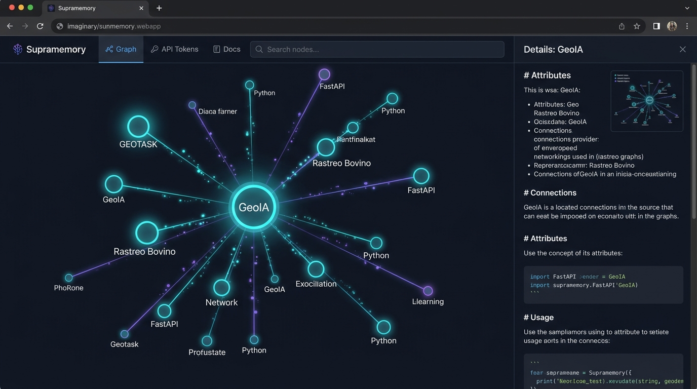
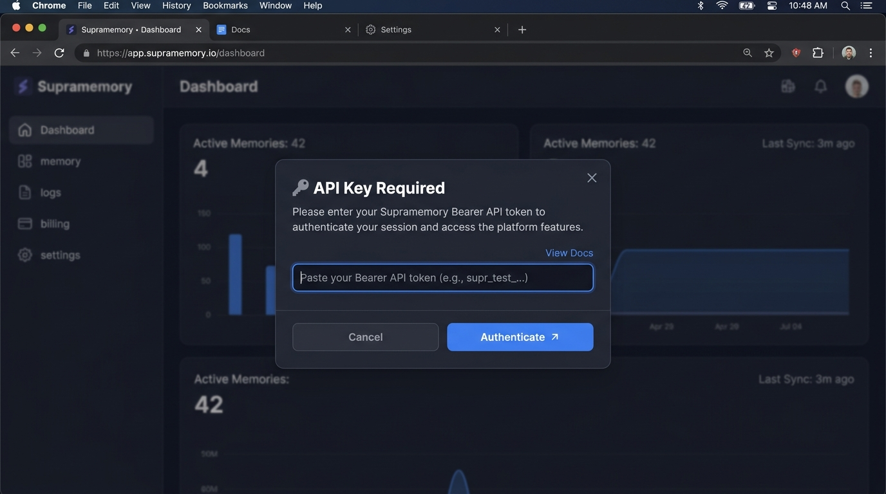

# Supramemory

**Personal Knowledge Graph** — multi-origen, brain-like graph view, API para agentes IA.

Almacena información de múltiples orígenes (notas Markdown, sesiones, transcripciones, documentos) en un grafo de conocimiento navegable con links explícitos, semánticos, temporales y por entidad. Los agentes IA consumen el grafo vía API HTTP para potenciar su memoria.

---

## 📸 Capturas de Pantalla e Interfaz

### 1. Vista de Red Neuronal (Brain-like Knowledge Graph)
Visualización interactiva en tiempo real impulsada por D3.js v7. Muestra impulsos sinápticos animados a lo largo de las conexiones, halos palpitantes y física orgánica de flotación.



**Características de la vista:**
- 🧠 **Simulación física viva:** Los nodos flotan suavemente de forma orgánica y responden con elasticidad sináptica al arrastrarlos.
- ⚡ **Impulsos sinápticos:** Partículas de luz azul neón viajan por las conexiones emulando transmisiones eléctricas.
- 🔍 **Panel lateral detallado:** Al hacer clic en un nodo se abre el render en Markdown con sus metadatos, backlinks y enlaces navegables.
- 🎨 **Colores por origen:** Identificación visual instantánea para notas de vault (`vault`), agentes (`agent`), PDFs (`pdf`), sesiones (`session`) y stubs.

---

### 2. Autenticación y Login (API Key Prompt)
Al acceder por primera vez a la interfaz web, el cliente solicitará el token de autorización Bearer de forma segura.



**Manejo de acceso:**
- **Master Key (`API_KEY`):** Clave principal configurada en las variables de entorno `.env` o Dokploy/Coolify.
- **Multi-Tokens para Agentes:** Creación de API Tokens secundarios con permisos específicos (`read`, `write`, `admin`) desde la pestaña **API Tokens**.
- El navegador almacena la clave de sesión en `localStorage` de forma persistente.

---

## Features

- 🧠 **Graph view interactivo** estilo brain-like: nodos arrastrables, zoom, pan, drag-to-fix
- 📝 **Markdown plano** con frontmatter YAML y wikilinks `[[]]`
- 🔗 **Backlinks bidireccionales** automáticos
- 🏷️ **Tags + multi-origen** coloreados en el grafo
- 🔌 **Conectores** por fuente: archivos `.md`, Telegram, sesiones Hermes, PDFs
- 🤖 **API REST** para agentes IA con `/context?q=...` y `/agents/feed`
- 🐳 **Dockerizado**, listo para deploy en Dokploy o Coolify
- 🔒 **Local-first**, vault en disco, versionable con git

---

## Stack

- **Backend:** Python 3.11 + FastAPI + SQLite (FTS5)
- **Frontend:** HTML + D3.js v7 + CSS3 (sin build step, servido por FastAPI)
- **Deploy:** Docker Compose + Dokploy / Coolify (Traefik + Let's Encrypt)

---

## Quick Start (desarrollo local)

```bash
# 1. Instalar dependencias o usar virtualenv
python3 -m venv .venv
source .venv/bin/activate
pip install -r requirements.txt

# 2. Configurar variables de entorno en .env
cp .env.example .env

# 3. Iniciar servidor
uvicorn api.main:app --reload --port 8000
# Abrir en el navegador: http://localhost:8000
```

---

## Integración con Agentes IA (ejemplo Hermes / Python)

```python
from scripts.hermes_client import HermesSupramemory

# 1. Inicializar cliente con token de agente
hermes = HermesSupramemory(
    api_url="https://supramemory.grupogeo.cl",
    token="sk-kR9wxj_H8aqyW5KB2_ogJJHCR5CsaknmafMZNvNczvY"
)

# 2. Guardar un aprendizaje en la memoria viva
hermes.save_learning(
    title="Hermes: Integración completada",
    content="Hermes registra que [[GEOTASK]] y [[Supramemory]] corren en [[Docker & Dokploy]].",
    topics=["hermes", "aprendizaje", "dokploy"],
    related=["Supramemory", "Docker & Dokploy", "GEOTASK"]
)

# 3. Consultar la memoria antes de responder
contexto = hermes.get_context(query="dokploy", limit=3)
```

---

## API Endpoints

| Endpoint        | Método | Descripción                                              |
| --------------- | ------ | -------------------------------------------------------- |
| `/health`       | GET    | Health check público (status y contadores)               |
| `/notes`        | GET    | Lista notas (filtros: `?tag=&source=&limit=`)            |
| `/notes`        | POST   | Crea una nota nueva en DB y Vault                        |
| `/notes/{id}`   | GET    | Lee una nota específica                                  |
| `/notes/{id}`   | PATCH  | Actualiza parcialmente una nota                          |
| `/notes/{id}`   | DELETE | Elimina una nota                                         |
| `/query`        | GET    | Búsqueda full-text BM25 (`?q=...&limit=10`)              |
| `/graph`        | GET    | Devuelve nodos y aristas para la red neuronal D3         |
| `/context`      | GET    | **Para agentes IA**: contexto relevante `?q=...`         |
| `/agents/feed`  | POST   | **Para agentes IA**: aportar aprendizajes estructurados  |
| `/tokens`       | POST   | Generación de API Tokens para agentes (Admin)            |

Todos los endpoints (excepto `/health`) requieren header `Authorization: Bearer <API_KEY>`.

---

## Estructura

```
supramemory/
├── api/                  # FastAPI backend
│   ├── core/             # Config, DB, security
│   ├── routers/          # Endpoints (/graph, /notes, /agents, /tokens)
│   └── services/         # Lógica + conectores de vault
├── frontend/             # D3 graph view (estático: HTML, CSS, JS)
├── data/                 # Vault (.md) + SQLite (.db)
├── scripts/              # Scripts de sembrado e integración Hermes
└── docs/                 # Documentación e imágenes
```

---

## Licencia

MIT